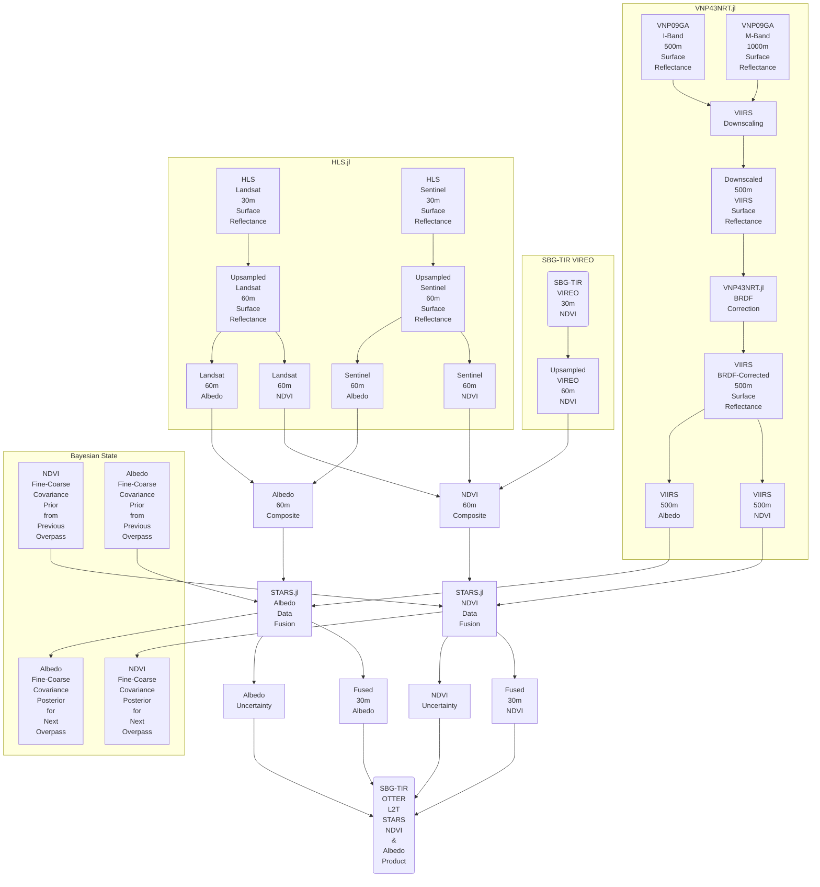

# SBG-TIR OTTER LST STARS NDVI & Albedo Product

This is the main repository for the Suface Biology and Geology Thermal Infrared (SBG-TIR) STARS NDVI and albedo data product. This product will utilize the [Spatial Timeseries for Automated high-Resolution multi-Sensor (STARS)](https://github.com/STARS-Data-Fusion) data fusion system to produce normalized difference vegetation index (NDVI) and albedo estimates corresponding to SBG-TIR OTTER surface temperature measurements, to support the [evapotranspiration product](https://github.com/sbg-tir/SBG-TIR-L3-ET).

The SBG collection 1 level 2 vegetation index and albedo data product is being developed based on the [ECOsystem Spaceborne Thermal Radiometer Experiment on Space Station (ECOSTRESS) collection 3 level 2 vegetation index and albedo data product](https://github.com/ECOSTRESS-Collection-3/SBGv001-L2-STARS).

[Gregory H. Halverson](https://github.com/gregory-halverson-jpl) (they/them) 
[gregory.h.halverson@jpl.nasa.gov](mailto:gregory.h.halverson@jpl.nasa.gov) 
NASA Jet Propulsion Laboratory 329G

[Margaret C. Johnson](https://github.com/majohnso) (she/her) 
[maggie.johnson@jpl.nasa.gov](mailto:maggie.johnson@jpl.nasa.gov) 
NASA Jet Propulsion Laboratory 398L

[Kerry Cawse-Nicholson](https://github.com/kcawse) (she/her) 
[kerry-anne.cawse-nicholson@jpl.nasa.gov](mailto:kerry-anne.cawse-nicholson@jpl.nasa.gov) 
NASA Jet Propulsion Laboratory 329G

[Claire Villanueva-Weeks](https://github.com/clairesvw) (she/her) 
[claire.s.villanueva-weeks@jpl.nasa.gov](mailto:claire.s.villanueva-weeks@jpl.nasa.gov) 
NASA Jet Propulsion Laboratory 329G

The code for the SBG level 2 STARS PGE will be developed using open-science practices based on the [ECOSTRESS collection 2 gridded and tiled product generation software](https://github.com/ECOSTRESS-Collection-2/ECOSTRESS-Collection-2).

This software will produce estimates of:
- Normalized Difference Vegetation Index (NDVI)
- albedo

NDVI and albedo are estimated at 60 m SBG standard resolution for each daytime SBG overpass by fusing temporally sparse but fine spatial resolution images from the Harmonized Landsat Sentinel (HLS) 2.0 product with daily, moderate spatial resolution images from the Suomi NPP Visible Infrared Imaging Radiometer Suite (VIIRS) VNP09GA product. The data fusion is performed using a variant of the Spatial Timeseries for Automated high-Resolution multi-Sensor data fusion (STARS) algorithm developed by Dr. Margaret Johnson and Gregory Halverson at the Jet Propulsion Laboratory. STARS is a Bayesian timeseries methodology that provides streaming data fusion and uncertainty quantification through efficient Kalman filtering.

Operationally, each L2T STARS tile run loads the means and covariances of the STARS model saved from the most recent tile run, then iteratively advances the means and covariances forward each day updating with fine imagery from HLS and/or moderate resolution imagery from VIIRS up to the day of the target SBG overpass. A pixelwise, lagged 16-day implementation of the VNP43 algorithm (Schaaf, 2017) is used for a near-real-time BRDF correction on the VNP09GA products to produce VIIRS NDVI and albedo.

## 1. Introduction to Data Products

The data format for the SBG products is described in the [SBG-TIR OTTER landing page](https://github.com/sbg-tir).

## 2. L2T STARS NDVI and Albedo Product

*Figure 1. Flowchart of the SBG-TIR L2T STARS processing workflow.*

NDVI and albedo are estimated at 60 m SBG standard resolution with uncertainty for each UTC day in which there is an SBG overpass by fusing temporally sparse but fine spatial resolution images from the Harmonized Landsat Sentinel (HLS) 2.0 product with daily, moderate spatial resolution images from the Suomi NPP Visible Infrared Imaging Radiometer Suite (VIIRS) VNP09GA product.

Landsat and Sentinel surface reflectances are collected using the [HLS.jl](https://github.com/STARS-Data-Fusion/HLS.jl) package.

VIIRS surface reflectance is downscaled and BRDF corrected using the [VNP43NRT.jl](https://github.com/STARS-Data-Fusion/VNP43NRT.jl) package. A pixelwise, lagged 16-day implementation of the VNP43 algorithm (Schaaf, 2017) is used for a near-real-time BRDF correction on the VNP09GA products to produce VIIRS NDVI and albedo.

The data fusion is performed with a variant of the Spatial Timeseries for Automated high-Resolution multi-Sensor data fusion (STARS) algorithm developed by Dr. Margaret Johnson and Gregory H. Halverson at the Jet Propulsion Laboratory using the [STARS.jl](https://github.com/STARS-Data-Fusion/STARS.jl) package. STARS is a Bayesian timeseries methodology that provides streaming data fusion and uncertainty quantification through efficient Kalman filtering. Operationally, each L2T STARS tile run loads the means and covariances of the STARS model saved from the most recent tile run, then iteratively advances the means and covariances forward each day updating with fine imagery from HLS and/or moderate resolution imagery from VIIRS up to the day of the target SBG overpass. 

The layers of the L2T STARS product are listed in Table 2. All layers of this product are represented by 32-bit floating point arrays. The NDVI estimates and 1σ uncertainties (-UQ) are unitless from -1 to 1. The albedo estimates and 1σ uncertainties (-UQ) are proportions from 0 to 1. 

| **Name** | **Description** | **Type** | **Units** | **Fill Value** | **No Data Value** | **Valid Min** | **Valid Max** |**Scale Factor** | **Size** |
| --- | --- | --- | --- | --- | --- | --- | --- | --- | -- |
| NDVI | Normalized Difference Vegetation Index | float32 | Index | NaN | N/A | -1 | 1 | N/A | 13.4 mb |
| NDVI-UQ | Normalized Difference Vegetation Index Uncertainty | float32 | Index | NaN | N/A | -1 | 1 | N/A | 13.4 mb |
| albedo | Albedo | float32 | Ratio | NaN | N/A | 0 | 1 | N/A | 13.4 mb |
| albedo-UQ | Albedo Uncertainty | float32 | Ratio | NaN | N/A | 0 | 1 | N/A | 13.4 mb |

*Table 2. Listing of L2T STARS data layers.*

## References

Schaaf, C. B. et al. (2017). *Algorithm Theoretical Basis Document for MODIS Bidirectional Reflectance Distribution Function and Albedo (MOD43) Products*. NASA. [Link to source](https://lpdaac.usgs.gov/documents/110/MOD43_ATBD.pdf)
