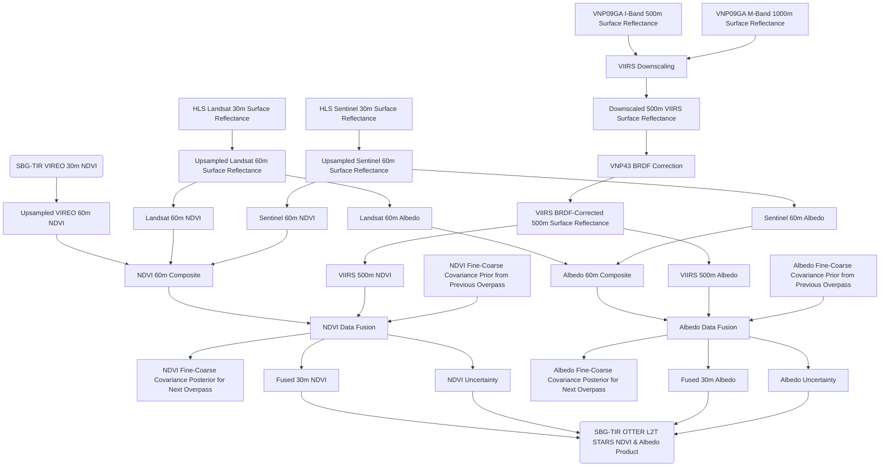

# SBG-TIR OTTER LST STARS NDVI & Albedo Product

[Gregory H. Halverson](https://github.com/gregory-halverson-jpl) (they/them) 
[gregory.h.halverson@jpl.nasa.gov](mailto:gregory.h.halverson@jpl.nasa.gov) 
NASA Jet Propulsion Laboratory 329G

[Margaret C. Johnson](https://github.com/majohnso) (she/her) 
[maggie.johnson@jpl.nasa.gov](mailto:maggie.johnson@jpl.nasa.gov) 
NASA Jet Propulsion Laboratory 398L

Kerry Cawse-Nicholson (she/her) 
[kerry-anne.cawse-nicholson@jpl.nasa.gov](mailto:kerry-anne.cawse-nicholson@jpl.nasa.gov) 
NASA Jet Propulsion Laboratory 329G

This is the main repository for the Suface Biology and Geology Thermal Infrared (SBG-TIR) STARS NDVI and albedo data product. This product will utilize the [Spatial Timeseries for Automated high-Resolution multi-Sensor (STARS)](https://github.com/STARS-Data-Fusion) data fusion system to produce normalized difference vegetation index (NDVI) and albedo estimates corresponding to SBG-TIR OTTER surface temperature measurements, to support the [evapotranspiration product](https://github.com/sbg-tir/SBG-TIR-L3-ET).

This software will produce estimates of:
- Normalized Difference Vegetation Index (NDVI)
- albedo

NDVI and albedo are estimated at 60 m SBG standard resolution for each daytime SBG overpass by fusing temporally sparse but fine spatial resolution images from the Harmonized Landsat Sentinel (HLS) 2.0 product with daily, moderate spatial resolution images from the Suomi NPP Visible Infrared Imaging Radiometer Suite (VIIRS) VNP09GA product. The data fusion is performed using a variant of the Spatial Timeseries for Automated high-Resolution multi-Sensor data fusion (STARS) algorithm developed by Dr. Margaret Johnson and Gregory Halverson at the Jet Propulsion Laboratory. STARS is a Bayesian timeseries methodology that provides streaming data fusion and uncertainty quantification through efficient Kalman filtering.

Operationally, each L2T STARS tile run loads the means and covariances of the STARS model saved from the most recent tile run, then iteratively advances the means and covariances forward each day updating with fine imagery from HLS and/or moderate resolution imagery from VIIRS up to the day of the target SBG overpass. A pixelwise, lagged 16-day implementation of the VNP43 algorithm (Schaaf, 2017) is used for a near-real-time BRDF correction on the VNP09GA products to produce VIIRS NDVI and albedo.

## Introduction to Data Products

This is the user guide for the SBG tiled products. SBG acquires data within an orbit, and this orbit path is divided into scenes roughly 935 x 935 km in size. The SBG orbit/scene/tile products are distributed in Cloud-Optimized GeoTIFF (COG) format. The tiled products are listed in Table 1.

| **Product Long Name** | **Product Short Name** |
| --- | --- |
| STARS NDVI/Albedo | L2T STARS |
| Auxiliary Inputs | L3T AUX |
| Evapotranspiration | L3T ET |
| Evaporative Stress Index | L4T ESI |
| Water Use Efficiency | L4T WUE |

*Table 1. Listing of SBG ecosystem products long names and short names.*

### Cloud-Optimized GeoTIFF Orbit/Scene/Tile Products 

To provide an analysis-ready format, the SBG products are distributed in a tiled form and using the COG format. The tiled products include the letter T in their level identifiers: L1CT, L2T, L3T, and L4T. The tiling system used for SBG is borrowed from the modified Military Grid Reference System (MGRS) tiling scheme used by Sentinel 2. These tiles divide the Universal Transverse Mercator (UTM) zones into square tiles 109800 m across. SBG uses a 60 m cell size with 1830 rows by 1830 columns in each tile, totaling 3.35 million pixels per tile. This allows the end user to assume that each 60 m SBG pixel will remain in the same location at each timestep observed in analysis. The COG format also facilitates end-user analysis as a universally recognized and supported format, compatible with open-source software, including QGIS, ArcGIS, GDAL, the Raster package in R, `rioxarray` in Python, and `Rasters.jl` in Julia.

Each `float32` data layer occupies 4 bytes of storage per pixel, which amounts to an uncompressed size of 13.4 mb for each tiled data layer. The `uint8` quality flag layers occupy a single byte per pixel, which amounts to an uncompressed size of 3.35 mb per tiled data quality layer.

Each `.tif` COG data layer in each L2T/L3T/L4T product additionally contains a rendered browse image in GeoJPEG format with a `.jpeg` extension. This image format is universally recognized and supported, and these files are compatible with Google Earth. Each L2T/L3T/L4T tile granule includes a `.json` file containing the Product Metadata and Standard Metadata in JSON format.

### Quality Flags

Two high-level quality flags are provided in all gridded and tiled products as thematic/binary masks encoded to zero and one in unsigned 8-bit integer layers. The cloud layer represents the final cloud test from L2 CLOUD. The water layer represents the surface water body in the Shuttle Radar Topography Mission (SRTM) Digital Elevation Model. For both layers, zero means absence, and one means presence. Pixels with the value 1 in the cloud layer represent detection of cloud in that pixel. Pixels with the value 1 in the water layer represent open water surface in that pixel. All tiled product data layers written in `float32` contain a standard not-a-number (`NaN`) value at each pixel that could not be retrieved. The cloud and water layers are provided to explain these missing values.

### Product Availability

The SBG products are available at the NASA Land Processes Distribution Active Archive Center (LP-DAAC), https://earthdata.nasa.gov/ and can be accessed via the Earthdata search engine. 

## L2T STARS NDVI and Albedo Product

NDVI and albedo are estimated at 60 m SBG standard resolution for each daytime SBG overpass by fusing temporally sparse but fine spatial resolution images from the Harmonized Landsat Sentinel (HLS) 2.0 product with daily, moderate spatial resolution images from the Suomi NPP Visible Infrared Imaging Radiometer Suite (VIIRS) VNP09GA product. The data fusion is performed using a variant of the Spatial Timeseries for Automated high-Resolution multi-Sensor data fusion (STARS) algorithm developed by Dr. Margaret Johnson and Gregory Halverson at the Jet Propulsion Laboratory. STARS is a Bayesian timeseries methodology that provides streaming data fusion and uncertainty quantification through efficient Kalman filtering. 

Operationally, each L2T STARS tile run loads the means and covariances of the STARS model saved from the most recent tile run, then iteratively advances the means and covariances forward each day updating with fine imagery from HLS and/or moderate resolution imagery from VIIRS up to the day of the target SBG overpass. A pixelwise, lagged 16-day implementation of the VNP43 algorithm (Schaaf, 2017) is used for a near-real-time BRDF correction on the VNP09GA products to produce VIIRS NDVI and albedo. 

Operationally, each L2T STARS tile run loads the means and covariances of the STARS model saved from the most recent tile run, then iteratively advances the means and covariances forward each day updating with fine imagery from HLS and/or moderate resolution imagery from VIIRS up to the day of the target SBG overpass. A pixelwise, lagged 16-day implementation of the VNP43 algorithm (Schaaf, 2017) is used for a near-real-time BRDF correction on the VNP09GA products to produce VIIRS NDVI and albedo. The layers of the L2T STARS product are listed in Table 2. All layers of this product are represented by 32-bit floating point arrays. The NDVI estimates and 1σ uncertainties (-UQ) are unitless from -1 to 1. The albedo estimates and 1σ uncertainties (-UQ) are proportions from 0 to 1. 

| **Name** | **Description** | **Type** | **Units** | **Fill Value** | **No Data Value** | **Valid Min** | **Valid Max** |**Scale Factor** | **Size** |
| --- | --- | --- | --- | --- | --- | --- | --- | --- | -- |
| NDVI | Normalized Difference Vegetation Index | float32 | Index | NaN | N/A | -1 | 1 | N/A | 12.06 mb |
| NDVI-UQ | Normalized Difference Vegetation Index Uncertainty | float32 | Index | NaN | N/A | -1 | 1 | N/A | 12.06 mb |
| albedo | Albedo | float32 | Ratio | NaN | N/A | 0 | 1 | N/A | 12.06 mb |
| albedo-UQ | Albedo Uncertainty | float32 | Ratio | NaN | N/A | 0 | 1 | N/A | 12.06 mb |

*Table 2. Listing of L2T STARS data layers.*

